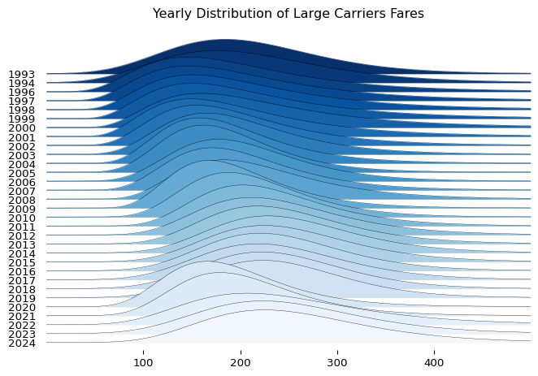
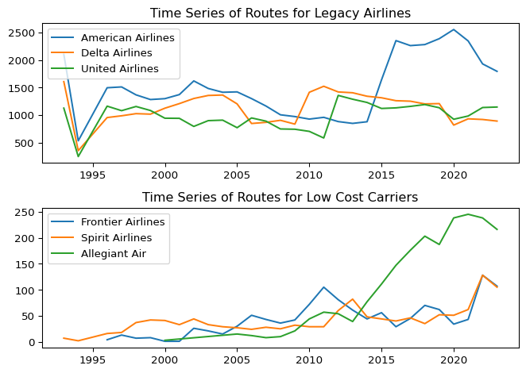
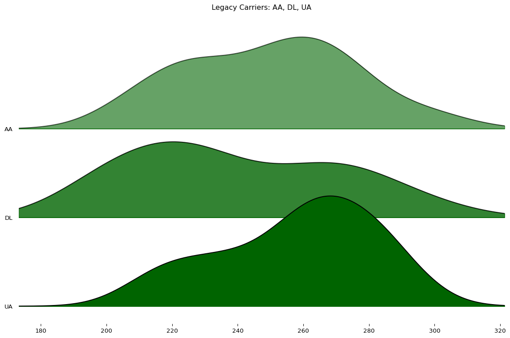
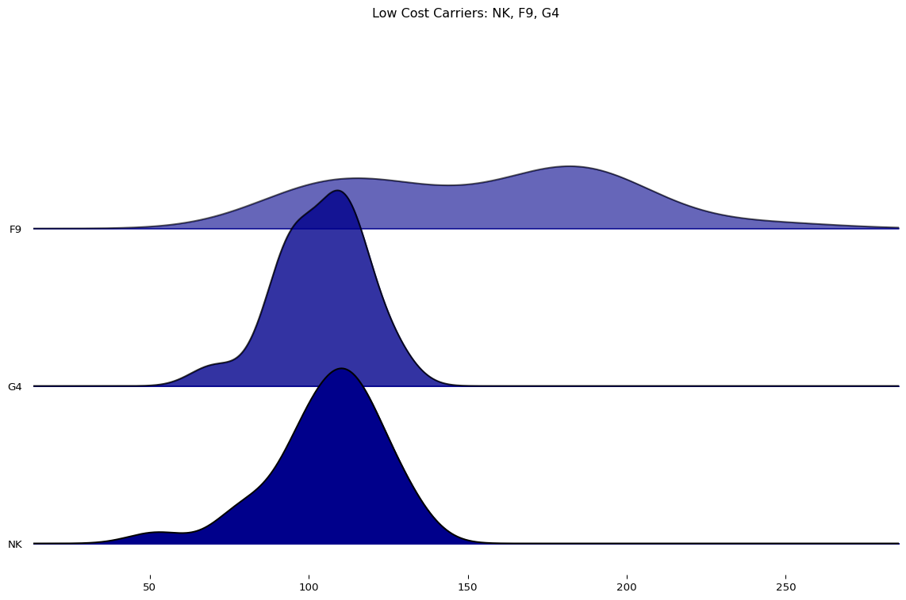
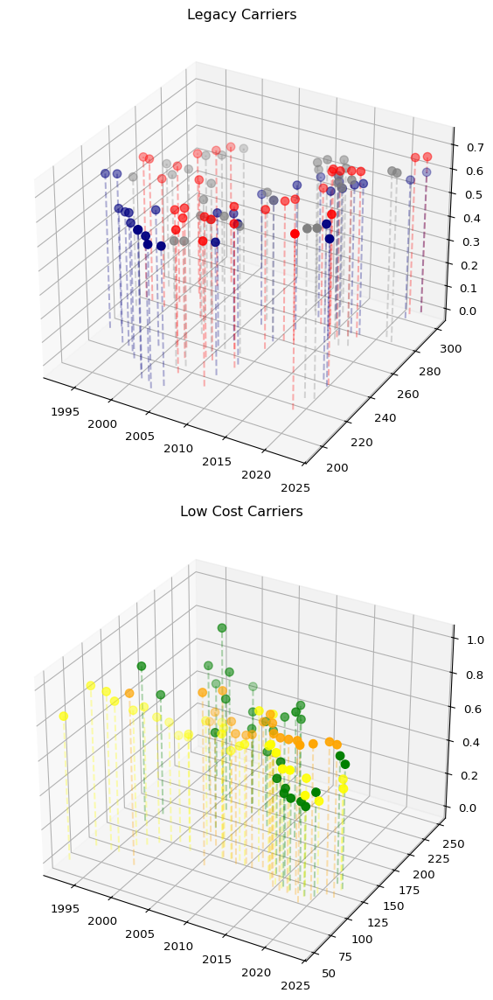

# Airline Routes
Luis Martinez

# Libraries

``` python
import polars as pl 
import numpy as np 
import matplotlib.pyplot as plt
import joypy
from matplotlib import cm
import matplotlib.gridspec as gridspec
import seaborn as sns
```

# Initial Analysis

We can first see how the data looks like and what can we do with this
data. For this we will use Polars lazy frames to keep the memory
efficient and only load those columns that we actually need. For this we
only load the first three rows of data and then we can get the main idea
of the columns we are working with.

``` python
initial = (
pl.scan_csv('US Airline Flight Routes and Fares 1993-2024.csv')
.head( n = 3 )
).collect()

initial
```

<div><style>
.dataframe > thead > tr,
.dataframe > tbody > tr {
  text-align: right;
  white-space: pre-wrap;
}
</style>
<small>shape: (3, 23)</small>

| tbl | Year | quarter | citymarketid_1 | citymarketid_2 | city1 | city2 | airportid_1 | airportid_2 | airport_1 | airport_2 | nsmiles | passengers | fare | carrier_lg | large_ms | fare_lg | carrier_low | lf_ms | fare_low | Geocoded_City1 | Geocoded_City2 | tbl1apk |
|----|----|----|----|----|----|----|----|----|----|----|----|----|----|----|----|----|----|----|----|----|----|----|
| str | i64 | i64 | i64 | i64 | str | str | i64 | i64 | str | str | i64 | i64 | f64 | str | f64 | f64 | str | f64 | f64 | str | str | str |
| "Table1a" | 2021 | 3 | 30135 | 33195 | "Allentown/Bethlehem/Easton, PA" | "Tampa, FL (Metropolitan Area)" | 10135 | 14112 | "ABE" | "PIE" | 970 | 180 | 81.43 | "G4" | 1.0 | 81.43 | "G4" | 1.0 | 81.43 | null | null | "202131013514112ABEPIE" |
| "Table1a" | 2021 | 3 | 30135 | 33195 | "Allentown/Bethlehem/Easton, PA" | "Tampa, FL (Metropolitan Area)" | 10135 | 15304 | "ABE" | "TPA" | 970 | 19 | 208.93 | "DL" | 0.4659 | 219.98 | "UA" | 0.1193 | 154.11 | null | null | "202131013515304ABETPA" |
| "Table1a" | 2021 | 3 | 30140 | 30194 | "Albuquerque, NM" | "Dallas/Fort Worth, TX" | 10140 | 11259 | "ABQ" | "DAL" | 580 | 204 | 184.56 | "WN" | 0.9968 | 184.44 | "WN" | 0.9968 | 184.44 | null | null | "202131014011259ABQDAL" |

</div>

Let’s review what columns are contained in this dataframe

``` python
initial.glimpse()
```

    Rows: 3
    Columns: 23
    $ tbl            <str> 'Table1a', 'Table1a', 'Table1a'
    $ Year           <i64> 2021, 2021, 2021
    $ quarter        <i64> 3, 3, 3
    $ citymarketid_1 <i64> 30135, 30135, 30140
    $ citymarketid_2 <i64> 33195, 33195, 30194
    $ city1          <str> 'Allentown/Bethlehem/Easton, PA', 'Allentown/Bethlehem/Easton, PA', 'Albuquerque, NM'
    $ city2          <str> 'Tampa, FL (Metropolitan Area)', 'Tampa, FL (Metropolitan Area)', 'Dallas/Fort Worth, TX'
    $ airportid_1    <i64> 10135, 10135, 10140
    $ airportid_2    <i64> 14112, 15304, 11259
    $ airport_1      <str> 'ABE', 'ABE', 'ABQ'
    $ airport_2      <str> 'PIE', 'TPA', 'DAL'
    $ nsmiles        <i64> 970, 970, 580
    $ passengers     <i64> 180, 19, 204
    $ fare           <f64> 81.43, 208.93, 184.56
    $ carrier_lg     <str> 'G4', 'DL', 'WN'
    $ large_ms       <f64> 1.0, 0.4659, 0.9968
    $ fare_lg        <f64> 81.43, 219.98, 184.44
    $ carrier_low    <str> 'G4', 'UA', 'WN'
    $ lf_ms          <f64> 1.0, 0.1193, 0.9968
    $ fare_low       <f64> 81.43, 154.11, 184.44
    $ Geocoded_City1 <str> null, null, null
    $ Geocoded_City2 <str> null, null, null
    $ tbl1apk        <str> '202131013514112ABEPIE', '202131013515304ABETPA', '202131014011259ABQDAL'

# Overall View

One of the first questions we want to answer is how is the distribution
of prices have changed during these years, specifically for those in
that control the market such as the legacy carriers.

``` python
year_rates = (
pl.scan_csv('US Airline Flight Routes and Fares 1993-2024.csv')
.select(['Year' ,'quarter' ,'fare_lg'])
).collect().to_pandas()

fig, axes = joypy.joyplot(year_rates, by = 'Year', column = 'fare_lg', x_range = [0, 500], kind = 'lognorm', linewidth = 0.25,
normalize = True, colormap = cm.Blues_r, title = 'Yearly Distribution of Large Carriers Fares')
plt.show()
```



We can see that prices have been shifting towards the left due to the
pandemic and then it is starting to shif again to the right through more
expensive mean prices, however the disperson of the prices have been
wide along the years.

# Legacy and Low Carrier

Lets focus on the Legacy and Ultra Low Cost carriers and see how they
behave on their pricing and routes, since this are tow of the most
competitive markets.

For the Legacy Carriers we will focus on the following: - American
Airlines - Delta Airlines - United Airlines

For Ultra Low Carriers - Spirit Airlines - Frontier Airlines - Allegiant
Air

First let’s investigate how their routes have behaved over the years and
who has more routes than the others up to 2024 where our data is
incomplete.

``` python
year_routes = (
    pl.scan_csv('US Airline Flight Routes and Fares 1993-2024.csv')
        .filter(( pl.col('carrier_lg').is_in(['AA', 'DL', 'UA', 'NK', 'F9', 'G4']) ) & (pl.col('Year') != 2024))
        .group_by([ pl.col('Year'), pl.col('carrier_lg') ])
        .agg(pl.col('tbl1apk').count().alias('Number of Routes'))
        .sort(pl.col('Year'))
        ).collect()

year_routes
```

<div><style>
.dataframe > thead > tr,
.dataframe > tbody > tr {
  text-align: right;
  white-space: pre-wrap;
}
</style>
<small>shape: (168, 3)</small>

| Year | carrier_lg | Number of Routes |
|------|------------|------------------|
| i64  | str        | u32              |
| 1993 | "DL"       | 1607             |
| 1993 | "UA"       | 1126             |
| 1993 | "AA"       | 2102             |
| 1993 | "NK"       | 7                |
| 1994 | "UA"       | 247              |
| …    | …          | …                |
| 2023 | "UA"       | 1146             |
| 2023 | "F9"       | 107              |
| 2023 | "AA"       | 1794             |
| 2023 | "G4"       | 216              |
| 2023 | "DL"       | 891              |

</div>

``` python
aa_data = year_routes.filter(pl.col('carrier_lg') == 'AA')
dl_data = year_routes.filter(pl.col('carrier_lg') == 'DL')
ua_data = year_routes.filter(pl.col('carrier_lg') == 'UA')
f9_data = year_routes.filter(pl.col('carrier_lg') == 'F9')
nk_data = year_routes.filter(pl.col('carrier_lg') == 'NK')
g4_data = year_routes.filter(pl.col('carrier_lg') == 'G4')

fig, ax = plt.subplots(2, 1)
ax[0].plot(aa_data['Year'], aa_data['Number of Routes'], label='American Airlines')
ax[0].plot(dl_data['Year'], dl_data['Number of Routes'], label='Delta Airlines')
ax[0].plot(ua_data['Year'], ua_data['Number of Routes'], label='United Airlines')
ax[0].set_title('Time Series of Routes for Legacy Airlines')
ax[0].legend(loc = 'upper left')
ax[1].plot(f9_data['Year'], f9_data['Number of Routes'], label='Frontier Airlines')
ax[1].plot(nk_data['Year'], nk_data['Number of Routes'], label='Spirit Airlines')
ax[1].plot(g4_data['Year'], g4_data['Number of Routes'], label='Allegiant Air')
ax[1].set_title('Time Series of Routes for Low Cost Carriers')
ax[1].legend()
plt.tight_layout()
plt.show()
```



This results are interesting, since we can see the rapid growth in
Allegiant Airlines around the 2008 mark, well this is because they went
public during that time and started the mid-size cities destinations.

Then in the legacy airlines we can see that AA has been dominant over
the years but Delta and United have keeped up.

Let’s focus on their distribution of prices over the years in their
routes.

``` python
legacy = ( pl.scan_csv('US Airline Flight Routes and Fares 1993-2024.csv')
.filter(( pl.col('carrier_lg').is_in(['AA', 'DL', 'UA']) ) & (pl.col('Year') != 2024))
.group_by([ pl.col('Year'), pl.col('carrier_lg') ])
.agg(pl.col('fare_lg').mean().alias('Average Rate'))
.sort(pl.col('Year'))
).collect().to_pandas()

low_cost = (
pl.scan_csv('US Airline Flight Routes and Fares 1993-2024.csv')
.filter(( pl.col('carrier_lg').is_in(['NK', 'F9', 'G4']) ) & (pl.col('Year') != 2024))
.group_by([ pl.col('Year'), pl.col('carrier_lg') ])
.agg(pl.col('fare_lg').mean().alias('Average Rate'))
.sort(pl.col('Year'))
).collect().to_pandas()
```

Let’s view the distribution of the Legacy Airlines

``` python
fig1, ax1 = joypy.joyplot(legacy, 
                          by='carrier_lg', 
                          column='Average Rate', 
                          figsize=(12, 8),
                          color='darkgreen', 
                          colormap=cm.Pastel1, 
                          fade=True, 
                          title="Legacy Carriers: AA, DL, UA",
                          overlap=1.5)
plt.show()
```



Let’s see the distribution of the Low Carrier Airlines

``` python
fig2, ax2 = joypy.joyplot(low_cost, 
                          by='carrier_lg', 
                          column='Average Rate', 
                          figsize=(12, 8),
                          color='darkblue', 
                          colormap=cm.Pastel2, 
                          fade=True, 
                          title="Low Cost Carriers: NK, F9, G4",
                          overlap=1.5)
plt.show()
```



After looking at this distributions another question we might ask
ourselves is with their pricing at a certain point in time how was their
market share of that market.

Meaning when having an average rate in a route or market, how much did
they “owned” of that market, this will give us a sense of volume. For
this let’s first try to visualize with a 3 dimensonial plot. We will
have years on the x axis, meaning years go from left to right, Average
rate on the y axis meaning how tall the line is, is the rate and on the
z axis their market share their depth is how market they had on that
year.

``` python
rates_market = (
    pl.scan_csv('US Airline Flight Routes and Fares 1993-2024.csv')
        .filter(( pl.col('carrier_lg').is_in(['AA', 'DL', 'UA', 'NK', 'F9', 'G4']) ) & (pl.col('Year') != 2024))
        .group_by([ pl.col('Year'), pl.col('carrier_lg') ])
        .agg(pl.col('fare_lg').mean().alias('Average Rate'), pl.col('large_ms').mean().alias('Average Market Share'))
        .sort(pl.col('Year'))
        ).collect()

rates_market
```

<div><style>
.dataframe > thead > tr,
.dataframe > tbody > tr {
  text-align: right;
  white-space: pre-wrap;
}
</style>
<small>shape: (168, 4)</small>

| Year | carrier_lg | Average Rate | Average Market Share |
|------|------------|--------------|----------------------|
| i64  | str        | f64          | f64                  |
| 1993 | "DL"       | 224.737063   | 0.655252             |
| 1993 | "AA"       | 253.147574   | 0.605224             |
| 1993 | "UA"       | 244.999103   | 0.555604             |
| 1993 | "NK"       | 52.204286    | 0.837143             |
| 1994 | "NK"       | 78.725       | 0.935                |
| …    | …          | …            | …                    |
| 2023 | "UA"       | 272.985419   | 0.711748             |
| 2023 | "NK"       | 116.626286   | 0.590725             |
| 2023 | "AA"       | 300.202664   | 0.664086             |
| 2023 | "G4"       | 105.35662    | 0.877016             |
| 2023 | "F9"       | 118.473458   | 0.722147             |

</div>

``` python
aa_rate = rates_market.filter(pl.col('carrier_lg') == 'AA')
dl_rate = rates_market.filter(pl.col('carrier_lg') == 'DL')
ua_rate = rates_market.filter(pl.col('carrier_lg') == 'UA')
f9_rate = rates_market.filter(pl.col('carrier_lg') == 'F9')
nk_rate = rates_market.filter(pl.col('carrier_lg') == 'NK')
g4_rate = rates_market.filter(pl.col('carrier_lg') == 'G4')

legacies = [
    (aa_rate, 'AA', 'Red'),
    (dl_rate, 'DL', 'Navy'),
    (ua_rate, 'UA', 'Gray')
]

low_cost = [
    (f9_rate, 'F9', 'Green'),
    (nk_rate, 'NK', 'Yellow'),
    (g4_rate, 'G4', 'Orange')
]

fig = plt.figure(figsize = (10, 12))
ax1 = fig.add_subplot(2, 1, 1, projection = '3d')
ax2 = fig.add_subplot(2, 1, 2, projection = '3d')
for data, label, color in legacies:
    ax1.scatter(data['Year'], data['Average Rate'], data['Average Market Share'], label = label, c = color, s = 50)
    
    for x, y, z in zip(data['Year'], data['Average Rate'], data['Average Market Share']):
        ax1.plot([x,x], [y,y], [0,z], c = color, label = label, alpha = 0.3, linestyle = '--')

for data, label, color in low_cost:
    ax2.scatter(data['Year'], data['Average Rate'], data['Average Market Share'], label = label, c = color, s = 50)

    for x, y, z in zip(data['Year'], data['Average Rate'], data['Average Market Share']):
        ax1.plot([x,x], [y,y], [0,z], c = color, label = label, alpha = 0.3, linestyle = '--')

ax1.set_title('Legacy Carriers')
ax2.set_title('Low Cost Carriers')

plt.tight_layout()

plt.show()
```


