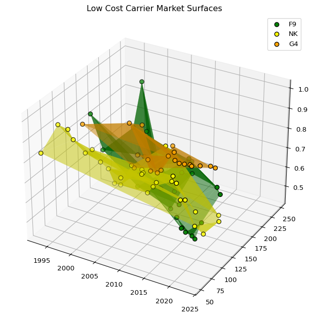
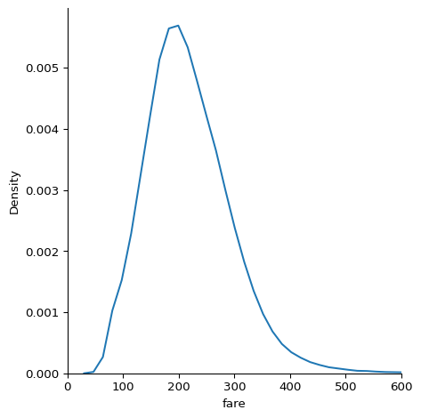
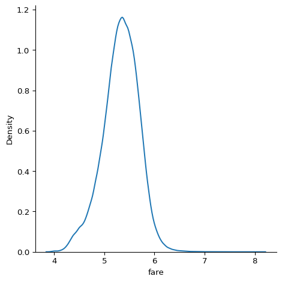
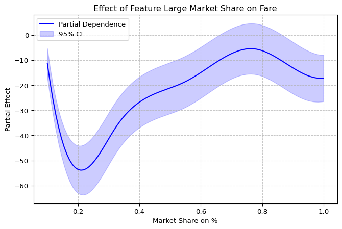

# Airline Routes
Luis Martinez

# Libraries

``` python
import polars as pl 
import numpy as np 
import matplotlib.pyplot as plt
import joypy
from matplotlib import cm
import matplotlib.gridspec as gridspec
import seaborn as sns
from scipy.interpolate import griddata
import pandas as pd
```

# Initial Analysis

We can first see how the data looks like and what can we do with this
data. For this we will use Polars lazy frames to keep the memory
efficient and only load those columns that we actually need. For this we
only load the first three rows of data and then we can get the main idea
of the columns we are working with.

``` python
initial = (
pl.scan_csv('US Airline Flight Routes and Fares 1993-2024.csv')
.head( n = 3 )
).collect()

initial
```

<div><style>
.dataframe > thead > tr,
.dataframe > tbody > tr {
  text-align: right;
  white-space: pre-wrap;
}
</style>
<small>shape: (3, 23)</small>

| tbl | Year | quarter | citymarketid_1 | citymarketid_2 | city1 | city2 | airportid_1 | airportid_2 | airport_1 | airport_2 | nsmiles | passengers | fare | carrier_lg | large_ms | fare_lg | carrier_low | lf_ms | fare_low | Geocoded_City1 | Geocoded_City2 | tbl1apk |
|----|----|----|----|----|----|----|----|----|----|----|----|----|----|----|----|----|----|----|----|----|----|----|
| str | i64 | i64 | i64 | i64 | str | str | i64 | i64 | str | str | i64 | i64 | f64 | str | f64 | f64 | str | f64 | f64 | str | str | str |
| "Table1a" | 2021 | 3 | 30135 | 33195 | "Allentown/Bethlehem/Easton, PA" | "Tampa, FL (Metropolitan Area)" | 10135 | 14112 | "ABE" | "PIE" | 970 | 180 | 81.43 | "G4" | 1.0 | 81.43 | "G4" | 1.0 | 81.43 | null | null | "202131013514112ABEPIE" |
| "Table1a" | 2021 | 3 | 30135 | 33195 | "Allentown/Bethlehem/Easton, PA" | "Tampa, FL (Metropolitan Area)" | 10135 | 15304 | "ABE" | "TPA" | 970 | 19 | 208.93 | "DL" | 0.4659 | 219.98 | "UA" | 0.1193 | 154.11 | null | null | "202131013515304ABETPA" |
| "Table1a" | 2021 | 3 | 30140 | 30194 | "Albuquerque, NM" | "Dallas/Fort Worth, TX" | 10140 | 11259 | "ABQ" | "DAL" | 580 | 204 | 184.56 | "WN" | 0.9968 | 184.44 | "WN" | 0.9968 | 184.44 | null | null | "202131014011259ABQDAL" |

</div>

Let’s review what columns are contained in this dataframe

``` python
initial.glimpse()
```

    Rows: 3
    Columns: 23
    $ tbl            <str> 'Table1a', 'Table1a', 'Table1a'
    $ Year           <i64> 2021, 2021, 2021
    $ quarter        <i64> 3, 3, 3
    $ citymarketid_1 <i64> 30135, 30135, 30140
    $ citymarketid_2 <i64> 33195, 33195, 30194
    $ city1          <str> 'Allentown/Bethlehem/Easton, PA', 'Allentown/Bethlehem/Easton, PA', 'Albuquerque, NM'
    $ city2          <str> 'Tampa, FL (Metropolitan Area)', 'Tampa, FL (Metropolitan Area)', 'Dallas/Fort Worth, TX'
    $ airportid_1    <i64> 10135, 10135, 10140
    $ airportid_2    <i64> 14112, 15304, 11259
    $ airport_1      <str> 'ABE', 'ABE', 'ABQ'
    $ airport_2      <str> 'PIE', 'TPA', 'DAL'
    $ nsmiles        <i64> 970, 970, 580
    $ passengers     <i64> 180, 19, 204
    $ fare           <f64> 81.43, 208.93, 184.56
    $ carrier_lg     <str> 'G4', 'DL', 'WN'
    $ large_ms       <f64> 1.0, 0.4659, 0.9968
    $ fare_lg        <f64> 81.43, 219.98, 184.44
    $ carrier_low    <str> 'G4', 'UA', 'WN'
    $ lf_ms          <f64> 1.0, 0.1193, 0.9968
    $ fare_low       <f64> 81.43, 154.11, 184.44
    $ Geocoded_City1 <str> null, null, null
    $ Geocoded_City2 <str> null, null, null
    $ tbl1apk        <str> '202131013514112ABEPIE', '202131013515304ABETPA', '202131014011259ABQDAL'

# Overall View

One of the first questions we want to answer is how is the distribution
of prices have changed during these years, specifically for those in
that control the market such as the legacy carriers.

``` python
year_rates = (
pl.scan_csv('US Airline Flight Routes and Fares 1993-2024.csv')
.select(['Year' ,'quarter' ,'fare_lg'])
).collect().to_pandas()

fig, axes = joypy.joyplot(year_rates, by = 'Year', column = 'fare_lg', x_range = [0, 500], kind = 'lognorm', linewidth = 0.25,
normalize = True, colormap = cm.Blues_r, title = 'Yearly Distribution of Large Carriers Fares')
plt.show()
```


We can see that prices have been shifting towards the left due to the
pandemic and then it is starting to shif again to the right through more
expensive mean prices, however the disperson of the prices have been
wide along the years.

# Legacy and Low Carrier

Lets focus on the Legacy and Ultra Low Cost carriers and see how they
behave on their pricing and routes, since this are tow of the most
competitive markets.

For the Legacy Carriers we will focus on the following: - American
Airlines - Delta Airlines - United Airlines

For Ultra Low Carriers - Spirit Airlines - Frontier Airlines - Allegiant
Air

First let’s investigate how their routes have behaved over the years and
who has more routes than the others up to 2024 where our data is
incomplete.

``` python
year_routes = (
    pl.scan_csv('US Airline Flight Routes and Fares 1993-2024.csv')
        .filter(( pl.col('carrier_lg').is_in(['AA', 'DL', 'UA', 'NK', 'F9', 'G4']) ) & (pl.col('Year') != 2024))
        .group_by([ pl.col('Year'), pl.col('carrier_lg') ])
        .agg(pl.col('tbl1apk').count().alias('Number of Routes'))
        .sort(pl.col('Year'))
        ).collect()

year_routes
```

<div><style>
.dataframe > thead > tr,
.dataframe > tbody > tr {
  text-align: right;
  white-space: pre-wrap;
}
</style>
<small>shape: (168, 3)</small>

| Year | carrier_lg | Number of Routes |
|------|------------|------------------|
| i64  | str        | u32              |
| 1993 | "AA"       | 2102             |
| 1993 | "NK"       | 7                |
| 1993 | "UA"       | 1126             |
| 1993 | "DL"       | 1607             |
| 1994 | "AA"       | 533              |
| …    | …          | …                |
| 2023 | "UA"       | 1146             |
| 2023 | "NK"       | 105              |
| 2023 | "DL"       | 891              |
| 2023 | "G4"       | 216              |
| 2023 | "AA"       | 1794             |

</div>

``` python
aa_data = year_routes.filter(pl.col('carrier_lg') == 'AA')
dl_data = year_routes.filter(pl.col('carrier_lg') == 'DL')
ua_data = year_routes.filter(pl.col('carrier_lg') == 'UA')
f9_data = year_routes.filter(pl.col('carrier_lg') == 'F9')
nk_data = year_routes.filter(pl.col('carrier_lg') == 'NK')
g4_data = year_routes.filter(pl.col('carrier_lg') == 'G4')

fig, ax = plt.subplots(2, 1)
ax[0].plot(aa_data['Year'], aa_data['Number of Routes'], label='American Airlines')
ax[0].plot(dl_data['Year'], dl_data['Number of Routes'], label='Delta Airlines')
ax[0].plot(ua_data['Year'], ua_data['Number of Routes'], label='United Airlines')
ax[0].set_title('Time Series of Routes for Legacy Airlines')
ax[0].legend(loc = 'upper left')
ax[1].plot(f9_data['Year'], f9_data['Number of Routes'], label='Frontier Airlines')
ax[1].plot(nk_data['Year'], nk_data['Number of Routes'], label='Spirit Airlines')
ax[1].plot(g4_data['Year'], g4_data['Number of Routes'], label='Allegiant Air')
ax[1].set_title('Time Series of Routes for Low Cost Carriers')
ax[1].legend()
plt.tight_layout()
plt.show()
```


This results are interesting, since we can see the rapid growth in
Allegiant Airlines around the 2008 mark, well this is because they went
public during that time and started the mid-size cities destinations.

Then in the legacy airlines we can see that AA has been dominant over
the years but Delta and United have keeped up.

Let’s focus on their distribution of prices over the years in their
routes.

``` python
legacy = ( pl.scan_csv('US Airline Flight Routes and Fares 1993-2024.csv')
.filter(( pl.col('carrier_lg').is_in(['AA', 'DL', 'UA']) ) & (pl.col('Year') != 2024))
.group_by([ pl.col('Year'), pl.col('carrier_lg') ])
.agg(pl.col('fare_lg').mean().alias('Average Rate'))
.sort(pl.col('Year'))
).collect().to_pandas()

low_cost = (
pl.scan_csv('US Airline Flight Routes and Fares 1993-2024.csv')
.filter(( pl.col('carrier_lg').is_in(['NK', 'F9', 'G4']) ) & (pl.col('Year') != 2024))
.group_by([ pl.col('Year'), pl.col('carrier_lg') ])
.agg(pl.col('fare_lg').mean().alias('Average Rate'))
.sort(pl.col('Year'))
).collect().to_pandas()
```

Let’s view the distribution of the Legacy Airlines

``` python
fig1, ax1 = joypy.joyplot(legacy, 
                          by='carrier_lg', 
                          column='Average Rate', 
                          figsize=(12, 8),
                          color='darkgreen', 
                          colormap=cm.Pastel1, 
                          fade=True, 
                          title="Legacy Carriers: AA, DL, UA",
                          overlap=1.5)
plt.show()
```


Let’s see the distribution of the Low Carrier Airlines

``` python
fig2, ax2 = joypy.joyplot(low_cost, 
                          by='carrier_lg', 
                          column='Average Rate', 
                          figsize=(12, 8),
                          color='darkblue', 
                          colormap=cm.Pastel2, 
                          fade=True, 
                          title="Low Cost Carriers: NK, F9, G4",
                          overlap=1.5)
plt.show()
```


After looking at this distributions another question we might ask
ourselves is with their pricing at a certain point in time how was their
market share of that market.

Meaning when having an average rate in a route or market, how much did
they “owned” of that market, this will give us a sense of volume. For
this let’s first try to visualize with a 3 dimensonial plot. We will
have years on the x axis, meaning years go from left to right, Average
rate on the y axis meaning how tall the line is, is the rate and on the
z axis their market share their depth is how market they had on that
year.

``` python
rates_market = (
    pl.scan_csv('US Airline Flight Routes and Fares 1993-2024.csv')
        .filter(( pl.col('carrier_lg').is_in(['AA', 'DL', 'UA', 'NK', 'F9', 'G4']) ) & (pl.col('Year') != 2024))
        .group_by([ pl.col('Year'), pl.col('carrier_lg') ])
        .agg(pl.col('fare_lg').mean().alias('Average Rate'), pl.col('large_ms').mean().alias('Average Market Share'))
        .sort(pl.col('Year'))
        ).collect()

rates_market
```

<div><style>
.dataframe > thead > tr,
.dataframe > tbody > tr {
  text-align: right;
  white-space: pre-wrap;
}
</style>
<small>shape: (168, 4)</small>

| Year | carrier_lg | Average Rate | Average Market Share |
|------|------------|--------------|----------------------|
| i64  | str        | f64          | f64                  |
| 1993 | "UA"       | 244.999103   | 0.555604             |
| 1993 | "AA"       | 253.147574   | 0.605224             |
| 1993 | "NK"       | 52.204286    | 0.837143             |
| 1993 | "DL"       | 224.737063   | 0.655252             |
| 1994 | "DL"       | 228.005424   | 0.648814             |
| …    | …          | …            | …                    |
| 2023 | "NK"       | 116.626286   | 0.590725             |
| 2023 | "G4"       | 105.35662    | 0.877016             |
| 2023 | "AA"       | 300.202664   | 0.664086             |
| 2023 | "UA"       | 272.985419   | 0.711748             |
| 2023 | "DL"       | 300.043861   | 0.600773             |

</div>

``` python
aa_rate = rates_market.filter(pl.col('carrier_lg') == 'AA')
dl_rate = rates_market.filter(pl.col('carrier_lg') == 'DL')
ua_rate = rates_market.filter(pl.col('carrier_lg') == 'UA')
f9_rate = rates_market.filter(pl.col('carrier_lg') == 'F9')
nk_rate = rates_market.filter(pl.col('carrier_lg') == 'NK')
g4_rate = rates_market.filter(pl.col('carrier_lg') == 'G4')

legacies = [
    (aa_rate, 'AA', 'Red'),
    (dl_rate, 'DL', 'Navy'),
    (ua_rate, 'UA', 'Gray')
]

low_cost = [
    (f9_rate, 'F9', 'Green'),
    (nk_rate, 'NK', 'Yellow'),
    (g4_rate, 'G4', 'Orange')
]

fig = plt.figure(figsize = (10, 12))
ax1 = fig.add_subplot(2, 1, 1, projection = '3d')
ax2 = fig.add_subplot(2, 1, 2, projection = '3d')
for data, label, color in legacies:
    ax1.scatter(data['Year'].to_numpy(), data['Average Rate'].to_numpy(), data['Average Market Share'].to_numpy(), label = label, c = color, s = 50)
    
    for x, y, z in zip(data['Year'].to_numpy(), data['Average Rate'].to_numpy(), data['Average Market Share'].to_numpy()):
        ax1.plot([x,x], [y,y], [0,z], c = color,  alpha = 0.3, linestyle = '--')

for data, label, color in low_cost:
    ax2.scatter(data['Year'].to_numpy(), data['Average Rate'].to_numpy(), data['Average Market Share'].to_numpy(), label = label, c = color, s = 50)
    for x, y, z in zip(data['Year'].to_numpy(), data['Average Rate'].to_numpy(), data['Average Market Share'].to_numpy()):
        ax2.plot([x,x], [y,y], [0,z], c = color,  alpha = 0.3, linestyle = '--')

ax1.set_title('Legacy Carriers')
ax2.set_title('Low Cost Carriers')
ax1.legend()
ax2.legend()

plt.tight_layout()

plt.show()
```


On the legacy airlines we can see that on the first years Delta was
always with the lowest rate but we can see that as time goes on they
slowl go further down in our cube, meaning that their average price in
the large routes got more expensive. American has a similar pattern but
they started with high rates and then lower them and then moved along
with Delta. The same can be said with United Airlines.

Now on the low cost carriers another story is being told. We can clearly
see a little down hill from the points. In the early establishment of
the Fare Act they owned a lot of the market with predatory pricing but
it seems that as time goes on thei market share dropped.

Lets look at this as a surface, because this explains why with the birth
of Revenue Management and capacity allocation, this low cost carriers
started loosing their market share, which it was in the beggining what
they were looking for.

``` python
fig = plt.figure(figsize=(10, 8))
ax = fig.add_subplot(111, projection='3d')

for data, label, color in low_cost:
    ax.plot_trisurf(data['Year'], 
                    data['Average Rate'], 
                    data['Average Market Share'], 
                    color=color, alpha=0.5)
    
    ax.scatter(data['Year'], data['Average Rate'], data['Average Market Share'], 
               c=color, s=40, edgecolors='black', label = label)

ax.set_title('Low Cost Carrier Market Surfaces')
ax.legend()
plt.show()
```



It is a little hard to visualize but we can see that Spirit has that
steeper cliff and the others follow along.

# Predictive Analytics

Now let’s explore a little bit of how we can use predictive analytics,
or supervised learning if you are fancy, to predict a price of a fare.

Let’s begin with a simple linear regression model and move our way up to
a Neural Network which is the state of the art for regression problems.
I mean regression because it is a continous variable.

So I want predict or explain the dispersion of the fare based on some
other covariates.

Let’s pick some of them for our analysis

``` python
full_data = (
    pl.scan_csv('US Airline Flight Routes and Fares 1993-2024.csv')
    .select(
    [
    'fare', 'nsmiles', 'passengers', 'large_ms', 'lf_ms', 'quarter',  'carrier_lg'
    ]
    )
    .with_columns(
    pl.col('quarter').cast(pl.String)
    )
    .drop_nulls()
).collect()

full_data = full_data.to_pandas()
```

First lets visualize our target variable, specially in regression this
is important since it tells us what distribution we should use.

To do this we can use a kde plot or a histogram

``` python
sns.displot(x = 'fare', kind = 'kde', data = full_data)
plt.xlim(0,600)
plt.show()
```



We do see a little bit of a tail so for kicks, let’s vizualise the log
of the fare which is almost the same as a gamma distribution.

``` python
log_fare = np.log(full_data['fare'] + 1)
sns.displot(x = log_fare, kind = 'kde')
plt.show()

full_data['log_fare'] = log_fare
```



## Data Partition

Now we can do the data partition for the training and test data to test
both the in sample goodness of fit and then the out of sample goodnes of
fit.

This is basically see how well our model could be trained on, the more
complex the model the better it will be but we will have to sacrifice
interpretability in the way.

We can do this the manual way or with sklearn, for this case let’s use
sklearn since it is simpler.

``` python
from sklearn.model_selection import train_test_split

train_data, test_data = train_test_split(
    full_data,
    test_size = 0.2,
    random_state = 10,
)
```

## Linear Regression

For our first model we will be using linear regression, this is the
simples and most interpretable model of them all.

For this we will use stats models package which is very similar to how R
works.

First lets import the function.

``` python
import statsmodels.formula.api as smf
```

Then we can construct a string with our list of covariates that will be
our formula for the linear regression.

``` python
formula_fare = 'fare ~ nsmiles + passengers + large_ms + lf_ms + C(quarter) +  C(carrier_lg)'
formula_log_fare = 'log_fare ~ nsmiles + passengers + large_ms + lf_ms + C(quarter) +  C(carrier_lg)'

lm1 = smf.ols(formula = formula_fare, data = train_data).fit()
lm2 = smf.ols(formula = formula_log_fare, data = train_data).fit()

print(lm1.summary())
print(lm2.summary())
```

                                OLS Regression Results                            
    ==============================================================================
    Dep. Variable:                   fare   R-squared:                       0.377
    Model:                            OLS   Adj. R-squared:                  0.377
    Method:                 Least Squares   F-statistic:                     1623.
    Date:                Thu, 14 May 2026   Prob (F-statistic):               0.00
    Time:                        15:53:06   Log-Likelihood:            -1.0866e+06
    No. Observations:              195474   AIC:                         2.173e+06
    Df Residuals:                  195400   BIC:                         2.174e+06
    Df Model:                          73                                         
    Covariance Type:            nonrobust                                         
    =======================================================================================
                              coef    std err          t      P>|t|      [0.025      0.975]
    ---------------------------------------------------------------------------------------
    Intercept             124.9404     23.742      5.262      0.000      78.406     171.475
    C(quarter)[T.2]         0.9055      0.400      2.263      0.024       0.121       1.690
    C(quarter)[T.3]        -3.6965      0.399     -9.266      0.000      -4.478      -2.915
    C(quarter)[T.4]        -4.0187      0.400    -10.049      0.000      -4.802      -3.235
    C(carrier_lg)[T.5J]   -56.4769     43.334     -1.303      0.192    -141.411      28.457
    C(carrier_lg)[T.9K]   144.6440     28.746      5.032      0.000      88.304     200.985
    C(carrier_lg)[T.9N]   -40.0463     27.578     -1.452      0.146     -94.098      14.005
    C(carrier_lg)[T.AA]    35.5264     23.739      1.497      0.135     -11.001      82.053
    C(carrier_lg)[T.AQ]   -52.3162     50.350     -1.039      0.299    -151.001      46.368
    C(carrier_lg)[T.AS]    -7.2659     23.761     -0.306      0.760     -53.837      39.305
    C(carrier_lg)[T.B6]   -17.5657     23.754     -0.739      0.460     -64.123      28.992
    C(carrier_lg)[T.BF]   -49.1349     32.502     -1.512      0.131    -112.837      14.567
    C(carrier_lg)[T.CO]     9.9966     23.743      0.421      0.674     -36.540      56.533
    C(carrier_lg)[T.DH]   -27.1906     24.255     -1.121      0.262     -74.730      20.349
    C(carrier_lg)[T.DL]    29.9510     23.739      1.262      0.207     -16.577      76.479
    C(carrier_lg)[T.E9]   -81.2214     43.335     -1.874      0.061    -166.157       3.714
    C(carrier_lg)[T.F9]   -36.9098     23.819     -1.550      0.121     -83.594       9.775
    C(carrier_lg)[T.FF]   -53.8482     28.748     -1.873      0.061    -110.194       2.497
    C(carrier_lg)[T.FL]   -34.7454     23.769     -1.462      0.144     -81.332      11.841
    C(carrier_lg)[T.G4]   -80.0135     23.786     -3.364      0.001    -126.633     -33.394
    C(carrier_lg)[T.HP]   -22.8139     23.764     -0.960      0.337     -69.391      23.763
    C(carrier_lg)[T.HQ]     1.9450     32.501      0.060      0.952     -61.756      65.646
    C(carrier_lg)[T.J7]   -52.8539     24.682     -2.141      0.032    -101.231      -4.477
    C(carrier_lg)[T.JI]   -33.4629     24.061     -1.391      0.164     -80.623      13.697
    C(carrier_lg)[T.KN]   -88.5191     34.938     -2.534      0.011    -156.997     -20.041
    C(carrier_lg)[T.KP]   -47.2223     26.360     -1.791      0.073     -98.887       4.442
    C(carrier_lg)[T.KS]     6.9914     67.133      0.104      0.917    -124.588     138.570
    C(carrier_lg)[T.KW]   -74.7984     25.255     -2.962      0.003    -124.297     -25.300
    C(carrier_lg)[T.LC]    31.1313     32.501      0.958      0.338     -32.571      94.833
    C(carrier_lg)[T.MX]   -28.1892     24.294     -1.160      0.246     -75.805      19.426
    C(carrier_lg)[T.N7]   -47.9308     26.449     -1.812      0.070     -99.770       3.908
    C(carrier_lg)[T.NJ]   -58.7650     24.777     -2.372      0.018    -107.328     -10.202
    C(carrier_lg)[T.NK]   -56.6664     23.816     -2.379      0.017    -103.345      -9.987
    C(carrier_lg)[T.NW]    24.8101     23.750      1.045      0.296     -21.740      71.360
    C(carrier_lg)[T.OE]   -19.5093     32.502     -0.600      0.548     -83.212      44.193
    C(carrier_lg)[T.OH]    17.8651     67.134      0.266      0.790    -113.716     149.446
    C(carrier_lg)[T.OO]   -39.5048     39.360     -1.004      0.316    -116.650      37.640
    C(carrier_lg)[T.OP]   -51.9713     50.353     -1.032      0.302    -150.662      46.719
    C(carrier_lg)[T.P9]   -91.6601     25.021     -3.663      0.000    -140.700     -42.620
    C(carrier_lg)[T.PA]   -52.2855     50.352     -1.038      0.299    -150.974      46.402
    C(carrier_lg)[T.PN]   -74.1422     30.363     -2.442      0.015    -133.652     -14.632
    C(carrier_lg)[T.QQ]   -50.7568     24.263     -2.092      0.036     -98.311      -3.203
    C(carrier_lg)[T.QX]   -50.5939     39.360     -1.285      0.199    -127.739      26.551
    C(carrier_lg)[T.RL]   -46.9273     50.351     -0.932      0.351    -145.613      51.759
    C(carrier_lg)[T.RP]    46.5570     30.363      1.533      0.125     -12.954     106.068
    C(carrier_lg)[T.RU]    -5.6385     24.262     -0.232      0.816     -53.191      41.914
    C(carrier_lg)[T.SX]   -92.0712     43.336     -2.125      0.034    -177.008      -7.134
    C(carrier_lg)[T.SY]   -17.4884     24.623     -0.710      0.478     -65.748      30.771
    C(carrier_lg)[T.T3]    50.5715     67.134      0.753      0.451     -81.009     182.152
    C(carrier_lg)[T.TB]    15.4261     32.513      0.474      0.635     -48.299      79.151
    C(carrier_lg)[T.TW]     3.7247     23.792      0.157      0.876     -42.908      50.357
    C(carrier_lg)[T.TZ]   -52.9075     23.814     -2.222      0.026     -99.583      -6.232
    C(carrier_lg)[T.U2]   -63.1927     31.647     -1.997      0.046    -125.220      -1.165
    C(carrier_lg)[T.U5]   -73.4146     24.561     -2.989      0.003    -121.555     -25.275
    C(carrier_lg)[T.UA]    40.2307     23.740      1.695      0.090      -6.299      86.760
    C(carrier_lg)[T.UK]    -4.6767     25.682     -0.182      0.856     -55.013      45.659
    C(carrier_lg)[T.US]    27.7506     23.740      1.169      0.242     -18.778      74.279
    C(carrier_lg)[T.VX]    36.0774     24.367      1.481      0.139     -11.681      83.836
    C(carrier_lg)[T.W7]   -68.4738     25.829     -2.651      0.008    -119.099     -17.849
    C(carrier_lg)[T.W9]   -16.9373     33.566     -0.505      0.614     -82.726      48.852
    C(carrier_lg)[T.WN]    -8.0292     23.738     -0.338      0.735     -54.555      38.497
    C(carrier_lg)[T.WV]   -72.8996     25.407     -2.869      0.004    -122.698     -23.102
    C(carrier_lg)[T.XJ]    32.1605     67.133      0.479      0.632     -99.418     163.740
    C(carrier_lg)[T.XP]   -58.6011     25.104     -2.334      0.020    -107.805      -9.398
    C(carrier_lg)[T.YV]   -45.9247     29.069     -1.580      0.114    -102.900      11.051
    C(carrier_lg)[T.YX]    -1.7320     23.845     -0.073      0.942     -48.467      45.003
    C(carrier_lg)[T.YY]    10.7269     30.949      0.347      0.729     -49.932      71.386
    C(carrier_lg)[T.ZA]   -21.2801     39.361     -0.541      0.589     -98.426      55.866
    C(carrier_lg)[T.ZV]   -60.1189     67.133     -0.896      0.371    -191.698      71.460
    C(carrier_lg)[T.ZW]    18.8786     29.867      0.632      0.527     -39.660      77.417
    nsmiles                 0.0574      0.000    248.655      0.000       0.057       0.058
    passengers             -0.0197      0.000    -68.004      0.000      -0.020      -0.019
    large_ms               34.2982      0.810     42.366      0.000      32.711      35.885
    lf_ms                 -11.2193      0.521    -21.534      0.000     -12.240     -10.198
    ==============================================================================
    Omnibus:                   135036.801   Durbin-Watson:                   2.008
    Prob(Omnibus):                  0.000   Jarque-Bera (JB):         16883464.854
    Skew:                           2.462   Prob(JB):                         0.00
    Kurtosis:                      48.262   Cond. No.                     1.94e+06
    ==============================================================================

    Notes:
    [1] Standard Errors assume that the covariance matrix of the errors is correctly specified.
    [2] The condition number is large, 1.94e+06. This might indicate that there are
    strong multicollinearity or other numerical problems.
                                OLS Regression Results                            
    ==============================================================================
    Dep. Variable:               log_fare   R-squared:                       0.423
    Model:                            OLS   Adj. R-squared:                  0.423
    Method:                 Least Squares   F-statistic:                     1966.
    Date:                Thu, 14 May 2026   Prob (F-statistic):               0.00
    Time:                        15:53:06   Log-Likelihood:                -23976.
    No. Observations:              195474   AIC:                         4.810e+04
    Df Residuals:                  195400   BIC:                         4.885e+04
    Df Model:                          73                                         
    Covariance Type:            nonrobust                                         
    =======================================================================================
                              coef    std err          t      P>|t|      [0.025      0.975]
    ---------------------------------------------------------------------------------------
    Intercept               4.9179      0.103     47.542      0.000       4.715       5.121
    C(quarter)[T.2]         0.0065      0.002      3.711      0.000       0.003       0.010
    C(quarter)[T.3]        -0.0146      0.002     -8.385      0.000      -0.018      -0.011
    C(quarter)[T.4]        -0.0129      0.002     -7.421      0.000      -0.016      -0.010
    C(carrier_lg)[T.5J]    -0.3642      0.189     -1.929      0.054      -0.734       0.006
    C(carrier_lg)[T.9K]     0.7116      0.125      5.682      0.000       0.466       0.957
    C(carrier_lg)[T.9N]    -0.2432      0.120     -2.024      0.043      -0.479      -0.008
    C(carrier_lg)[T.AA]     0.1997      0.103      1.931      0.054      -0.003       0.402
    C(carrier_lg)[T.AQ]    -0.3751      0.219     -1.710      0.087      -0.805       0.055
    C(carrier_lg)[T.AS]     0.0032      0.104      0.031      0.975      -0.200       0.206
    C(carrier_lg)[T.B6]    -0.0349      0.103     -0.337      0.736      -0.238       0.168
    C(carrier_lg)[T.BF]    -0.1875      0.142     -1.324      0.186      -0.465       0.090
    C(carrier_lg)[T.CO]     0.0863      0.103      0.835      0.404      -0.116       0.289
    C(carrier_lg)[T.DH]    -0.1528      0.106     -1.446      0.148      -0.360       0.054
    C(carrier_lg)[T.DL]     0.1764      0.103      1.705      0.088      -0.026       0.379
    C(carrier_lg)[T.E9]    -0.4581      0.189     -2.426      0.015      -0.828      -0.088
    C(carrier_lg)[T.F9]    -0.1306      0.104     -1.259      0.208      -0.334       0.073
    C(carrier_lg)[T.FF]    -0.2244      0.125     -1.792      0.073      -0.470       0.021
    C(carrier_lg)[T.FL]    -0.1425      0.104     -1.376      0.169      -0.346       0.060
    C(carrier_lg)[T.G4]    -0.4547      0.104     -4.387      0.000      -0.658      -0.252
    C(carrier_lg)[T.HP]    -0.0772      0.104     -0.745      0.456      -0.280       0.126
    C(carrier_lg)[T.HQ]     0.0149      0.142      0.105      0.916      -0.263       0.292
    C(carrier_lg)[T.J7]    -0.2924      0.108     -2.719      0.007      -0.503      -0.082
    C(carrier_lg)[T.JI]    -0.1567      0.105     -1.494      0.135      -0.362       0.049
    C(carrier_lg)[T.KN]    -0.6519      0.152     -4.282      0.000      -0.950      -0.354
    C(carrier_lg)[T.KP]    -0.2696      0.115     -2.348      0.019      -0.495      -0.045
    C(carrier_lg)[T.KS]     0.0885      0.292      0.303      0.762      -0.485       0.662
    C(carrier_lg)[T.KW]    -0.3700      0.110     -3.362      0.001      -0.586      -0.154
    C(carrier_lg)[T.LC]     0.2222      0.142      1.569      0.117      -0.055       0.500
    C(carrier_lg)[T.MX]    -0.1222      0.106     -1.155      0.248      -0.330       0.085
    C(carrier_lg)[T.N7]    -0.2085      0.115     -1.809      0.070      -0.434       0.017
    C(carrier_lg)[T.NJ]    -0.3393      0.108     -3.143      0.002      -0.551      -0.128
    C(carrier_lg)[T.NK]    -0.2800      0.104     -2.698      0.007      -0.483      -0.077
    C(carrier_lg)[T.NW]     0.1535      0.103      1.483      0.138      -0.049       0.356
    C(carrier_lg)[T.OE]    -0.1375      0.142     -0.971      0.332      -0.415       0.140
    C(carrier_lg)[T.OH]     0.1071      0.292      0.366      0.714      -0.466       0.680
    C(carrier_lg)[T.OO]    -0.3015      0.171     -1.758      0.079      -0.638       0.035
    C(carrier_lg)[T.OP]    -0.2639      0.219     -1.203      0.229      -0.694       0.166
    C(carrier_lg)[T.P9]    -0.6010      0.109     -5.513      0.000      -0.815      -0.387
    C(carrier_lg)[T.PA]    -0.2837      0.219     -1.293      0.196      -0.714       0.146
    C(carrier_lg)[T.PN]    -0.3925      0.132     -2.967      0.003      -0.652      -0.133
    C(carrier_lg)[T.QQ]    -0.3346      0.106     -3.165      0.002      -0.542      -0.127
    C(carrier_lg)[T.QX]    -0.3453      0.171     -2.013      0.044      -0.681      -0.009
    C(carrier_lg)[T.RL]    -0.1722      0.219     -0.785      0.433      -0.602       0.258
    C(carrier_lg)[T.RP]     0.2779      0.132      2.101      0.036       0.019       0.537
    C(carrier_lg)[T.RU]    -0.0592      0.106     -0.560      0.575      -0.266       0.148
    C(carrier_lg)[T.SX]    -0.3971      0.189     -2.103      0.035      -0.767      -0.027
    C(carrier_lg)[T.SY]    -0.0312      0.107     -0.291      0.771      -0.241       0.179
    C(carrier_lg)[T.T3]     0.3004      0.292      1.027      0.304      -0.273       0.874
    C(carrier_lg)[T.TB]    -0.0384      0.142     -0.271      0.786      -0.316       0.239
    C(carrier_lg)[T.TW]     0.0258      0.104      0.249      0.804      -0.177       0.229
    C(carrier_lg)[T.TZ]    -0.2340      0.104     -2.255      0.024      -0.437      -0.031
    C(carrier_lg)[T.U2]    -0.4210      0.138     -3.053      0.002      -0.691      -0.151
    C(carrier_lg)[T.U5]    -0.3562      0.107     -3.328      0.001      -0.566      -0.146
    C(carrier_lg)[T.UA]     0.2164      0.103      2.092      0.036       0.014       0.419
    C(carrier_lg)[T.UK]    -0.0769      0.112     -0.687      0.492      -0.296       0.142
    C(carrier_lg)[T.US]     0.1716      0.103      1.659      0.097      -0.031       0.374
    C(carrier_lg)[T.VX]     0.2112      0.106      1.990      0.047       0.003       0.419
    C(carrier_lg)[T.W7]    -0.3670      0.113     -3.261      0.001      -0.588      -0.146
    C(carrier_lg)[T.W9]    -0.0837      0.146     -0.572      0.567      -0.370       0.203
    C(carrier_lg)[T.WN]     0.0058      0.103      0.056      0.956      -0.197       0.208
    C(carrier_lg)[T.WV]    -0.4487      0.111     -4.053      0.000      -0.666      -0.232
    C(carrier_lg)[T.XJ]     0.2426      0.292      0.829      0.407      -0.331       0.816
    C(carrier_lg)[T.XP]    -0.2934      0.109     -2.682      0.007      -0.508      -0.079
    C(carrier_lg)[T.YV]    -0.3268      0.127     -2.580      0.010      -0.575      -0.079
    C(carrier_lg)[T.YX]     0.0511      0.104      0.491      0.623      -0.153       0.255
    C(carrier_lg)[T.YY]    -0.1046      0.135     -0.776      0.438      -0.369       0.160
    C(carrier_lg)[T.ZA]    -0.0253      0.171     -0.148      0.883      -0.361       0.311
    C(carrier_lg)[T.ZV]    -0.4045      0.292     -1.383      0.167      -0.978       0.169
    C(carrier_lg)[T.ZW]     0.1077      0.130      0.828      0.408      -0.147       0.363
    nsmiles                 0.0003   1.01e-06    255.291      0.000       0.000       0.000
    passengers             -0.0001   1.26e-06    -84.757      0.000      -0.000      -0.000
    large_ms                0.1184      0.004     33.576      0.000       0.112       0.125
    lf_ms                  -0.0941      0.002    -41.472      0.000      -0.099      -0.090
    ==============================================================================
    Omnibus:                     3633.711   Durbin-Watson:                   2.006
    Prob(Omnibus):                  0.000   Jarque-Bera (JB):             7600.440
    Skew:                          -0.041   Prob(JB):                         0.00
    Kurtosis:                       3.963   Cond. No.                     1.94e+06
    ==============================================================================

    Notes:
    [1] Standard Errors assume that the covariance matrix of the errors is correctly specified.
    [2] The condition number is large, 1.94e+06. This might indicate that there are
    strong multicollinearity or other numerical problems.

So here we can see that looking at the goodness of fit or the reduction
in the sum of squares called R squared, our log model worked better.
This is because we are compressing the fares into a more like normal
distribution. Linear regression is based on that the target variable
follows a linear regression, we can also use a gamma regression for
tailed distributions.

Now lets predict and see how well is the out of sample prediction with
metrics like MAE, RMSE, MAPE

First let’s create a function to give us this metrics, since we will be
using it later on.

``` python
from sklearn.metrics import mean_squared_error, mean_absolute_error, mean_absolute_percentage_error

def get_metrics(actual, predicted):
    mae = mean_absolute_error(actual, predicted)
    rmse = np.sqrt(mean_squared_error(actual, predicted))
    mape = mean_absolute_percentage_error(actual, predicted)
    print(f"MAE:  ${mae:.2f}")
    print(f"RMSE: ${rmse:.2f}")
    print(f"MAPE: {mape:.2%}")
```

Now we can get the predictions for both linear regressions

``` python
lm1_pred = lm1.predict(test_data.drop(['fare', 'log_fare'], axis = 1)) 
lm2_pred = np.exp(lm2.predict(test_data.drop(['fare', 'log_fare'], axis = 1))) - 1

get_metrics(test_data['fare'], lm1_pred)
get_metrics(test_data['fare'], lm2_pred)
```

    MAE:  $45.49
    RMSE: $62.20
    MAPE: 22.90%
    MAE:  $45.82
    RMSE: $63.36
    MAPE: 22.16%

## Generalized Linear Model

``` python
from pygam import LinearGAM, s, f

X = train_data.drop(['fare', 'log_fare'], axis = 1)
y = train_data['fare'].values
y_log = train_data['log_fare'].values
```

Now we can train the linear GAM and specify how many degrees of freedom
we want or in others words how many splines to divide the cubic
function, the more freedom the more smoothness of the line however the
more tendency to overfit. We will use 4 since that is the default for
first experiment.

Before we do the formula we need to do some label encoding, since this
package is built on pure numpy and not with strings or pandas
categorical objects.

``` python
from sklearn.preprocessing import LabelEncoder

le = LabelEncoder()

x_encoded = X.copy()

x_encoded.iloc[:, 4] = le.fit_transform(x_encoded.iloc[:,4])
x_encoded.iloc[:, 5] = le.fit_transform(x_encoded.iloc[:,5])

X_encoded = x_encoded.values.astype(float)
```

``` python
gam1 = LinearGAM(s(0, n_splines = 7) + s(1, n_splines = 7) + s(2, n_splines = 7) + s(3, n_splines = 7) + f(4) + f(5)).fit(X_encoded,y)
gam2 = LinearGAM(s(0, n_splines = 7) + s(1, n_splines = 7) + s(2, n_splines = 7) + s(3, n_splines = 7) + f(4) + f(5)).fit(X_encoded,y_log)

print(gam1.summary())
print(gam2.summary())
```

    LinearGAM                                                                                                 
    =============================================== ==========================================================
    Distribution:                        NormalDist Effective DoF:                                      87.116
    Link Function:                     IdentityLink Log Likelihood:                               -1082676.027
    Number of Samples:                       195474 AIC:                                           2165528.286
                                                    AICc:                                         2165528.3663
                                                    GCV:                                             3792.6258
                                                    Scale:                                             61.5596
                                                    Pseudo R-Squared:                                   0.4017
    ==========================================================================================================
    Feature Function                  Lambda               Rank         EDoF         P > x        Sig. Code   
    ================================= ==================== ============ ============ ============ ============
    s(0)                              [0.6]                7            6.9          1.11e-16     ***         
    s(1)                              [0.6]                7            4.7          1.11e-16     ***         
    s(2)                              [0.6]                7            5.6          1.11e-16     ***         
    s(3)                              [0.6]                7            5.8          1.11e-16     ***         
    f(4)                              [0.6]                4            3.0          1.11e-16     ***         
    f(5)                              [0.6]                67           61.2         1.11e-16     ***         
    intercept                                              1            0.0          1.11e-16     ***         
    ==========================================================================================================
    Significance codes:  0 '***' 0.001 '**' 0.01 '*' 0.05 '.' 0.1 ' ' 1

    WARNING: Fitting splines and a linear function to a feature introduces a model identifiability problem
             which can cause p-values to appear significant when they are not.

    WARNING: p-values calculated in this manner behave correctly for un-penalized models or models with
             known smoothing parameters, but when smoothing parameters have been estimated, the p-values
             are typically lower than they should be, meaning that the tests reject the null too readily.
    None
    LinearGAM                                                                                                 
    =============================================== ==========================================================
    Distribution:                        NormalDist Effective DoF:                                      87.116
    Link Function:                     IdentityLink Log Likelihood:                                -19089.5309
    Number of Samples:                       195474 AIC:                                            38355.2937
                                                    AICc:                                            38355.374
                                                    GCV:                                                0.0713
                                                    Scale:                                              0.2669
                                                    Pseudo R-Squared:                                   0.4515
    ==========================================================================================================
    Feature Function                  Lambda               Rank         EDoF         P > x        Sig. Code   
    ================================= ==================== ============ ============ ============ ============
    s(0)                              [0.6]                7            6.9          1.11e-16     ***         
    s(1)                              [0.6]                7            4.7          1.11e-16     ***         
    s(2)                              [0.6]                7            5.6          1.11e-16     ***         
    s(3)                              [0.6]                7            5.8          1.11e-16     ***         
    f(4)                              [0.6]                4            3.0          1.11e-16     ***         
    f(5)                              [0.6]                67           61.2         1.11e-16     ***         
    intercept                                              1            0.0          1.11e-16     ***         
    ==========================================================================================================
    Significance codes:  0 '***' 0.001 '**' 0.01 '*' 0.05 '.' 0.1 ' ' 1

    WARNING: Fitting splines and a linear function to a feature introduces a model identifiability problem
             which can cause p-values to appear significant when they are not.

    WARNING: p-values calculated in this manner behave correctly for un-penalized models or models with
             known smoothing parameters, but when smoothing parameters have been estimated, the p-values
             are typically lower than they should be, meaning that the tests reject the null too readily.
    None

    C:\Users\luism\AppData\Local\Temp\ipykernel_34388\4115508990.py:4: UserWarning:

    KNOWN BUG: p-values computed in this summary are likely much smaller than they should be. 
     
    Please do not make inferences based on these values! 

    Collaborate on a solution, and stay up to date at: 
    github.com/dswah/pyGAM/issues/163 


    C:\Users\luism\AppData\Local\Temp\ipykernel_34388\4115508990.py:5: UserWarning:

    KNOWN BUG: p-values computed in this summary are likely much smaller than they should be. 
     
    Please do not make inferences based on these values! 

    Collaborate on a solution, and stay up to date at: 
    github.com/dswah/pyGAM/issues/163 

So now we can visualize the splines and see how non linear relationships
are captured by GAM, which is a more complicated model than a OLS

Using partial dependece we can see that as the market share of the large
carrier increases there is a non linear relationship with the fare on
the partial dependece

``` python
XX = gam1.generate_X_grid(term=2)

pdep, confi = gam1.partial_dependence(term=2, X=XX, width=0.95)

plt.figure(figsize=(8, 5))
plt.plot(XX[:, 2], pdep, label='Partial Dependence', color='blue')
plt.fill_between(XX[:, 2], confi[:, 0], confi[:, 1], alpha=0.2, color='blue', label='95% CI')

plt.title(f'Effect of Feature Large Market Share on Fare')
plt.xlabel('Market Share on %')
plt.ylabel('Partial Effect')
plt.legend()
plt.grid(True, linestyle='--', alpha=0.7)
plt.show()
```



Now we can create the out of sample test by looking how it does on
unseen data, but first we have to encode the test data as well

``` python
X_test = test_data.drop(['fare', 'log_fare'], axis = 1)
x_test_encoded = X_test.copy()

x_test_encoded.iloc[:, 4] = le.fit_transform(x_test_encoded.iloc[:,4])
x_test_encoded.iloc[:, 5] = le.fit_transform(x_test_encoded.iloc[:,5])

X_test_encoded = x_test_encoded.values.astype(float)
```

``` python
gam1_pred = gam1.predict(X_test_encoded)
gam2_pred = np.exp(gam2.predict(X_test_encoded)) - 1
```

``` python
get_metrics(test_data['fare'].values, gam1_pred)
get_metrics(test_data['fare'].values, gam2_pred)
```

    MAE:  $56.93
    RMSE: $75.44
    MAPE: 26.29%
    MAE:  $59.29
    RMSE: $79.37
    MAPE: 26.19%
